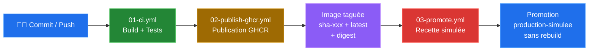

# 02 - Schéma de la chaîne CI/CD

## Schéma logique

## Explication de chaque étape

**1. Commit / Push** : le développeur pousse son code sur le dépôt GitHub. Ce push déclenche automatiquement le premier workflow de CI.

**2. Build + Tests (01-ci.yml)** : ce workflow vérifie la présence des fichiers attendus (Dockerfile, compose.yml, site/index.html, site/version.json, docs/08-compte-rendu-final.md), valide la syntaxe Docker Compose, construit l'image Docker localement, puis teste le conteneur en effectuant des requêtes HTTP sur la page d'accueil et le fichier version.json. Si une étape échoue, le pipeline s'arrête.

**3. Publication GHCR (02-publish-ghcr.yml)** : déclenché uniquement sur la branche `main`, ce workflow construit l'image et la publie dans GitHub Container Registry. L'image reçoit deux tags : `sha-<commit>` pour la traçabilité et `latest` comme tag glissant.

**4. Image taguée + digest** : une fois publiée, l'image est identifiable par son tag et par un digest SHA256 immuable. Ce digest garantit que l'artefact ne peut pas être modifié silencieusement.

**5. Validation recette (03-promote.yml, étape 1)** : le workflow de promotion est déclenché manuellement (`workflow_dispatch`). L'image source est téléchargée depuis GHCR (sans rebuild), puis testée via des requêtes HTTP dans un environnement GitHub nommé `recette`.

**6. Promotion production-simulee (03-promote.yml, étape 2)** : si la recette est validée, l'image existante est re-taguée `production-simulee` et poussée sur GHCR. Il n'y a aucun rebuild : c'est exactement le même artefact binaire qui est promu.

## Orchestration légère

Le fichier `compose.yml` décrit deux services :
- **web** : le conteneur Nginx servant le site statique, avec un healthcheck intégré ;
- **tester** : un conteneur léger (curlimages/curl) qui attend que le service web soit en bonne santé puis effectue des requêtes HTTP de validation.

Ce fichier sert à documenter et simuler une coordination de conteneurs. Il permet de vérifier localement le bon fonctionnement de l'image avant de la publier.

## Limite importante

Docker Compose est un outil d'orchestration locale adapté au développement et aux tests. Il ne remplace pas une orchestration de production. En environnement réel, il faudrait traiter :
- la haute disponibilité (répartition sur plusieurs nœuds) ;
- la répartition de charge (load balancer devant les instances) ;
- la supervision et l'alerting (monitoring des conteneurs et des services) ;
- les politiques de déploiement (rolling update, blue-green, canary) ;
- le rollback automatisé en cas d'échec de healthcheck ;
- la gestion des secrets et des configurations par environnement ;
- la sauvegarde et la restauration des données et configurations.

Un orchestrateur comme Kubernetes répondrait à ces besoins, mais dépasse le cadre de ce projet pédagogique.
